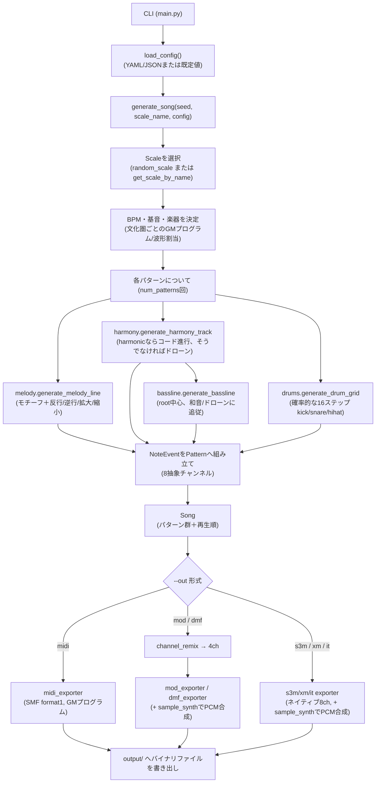

# TrackerMaker

**[English](./README.md) | [日本語](#日本語)**

シード値で再現可能な、世界の音階に対応したトラッカー向けランダム作曲エンジン。
Pythonのみ（外部依存はほぼ無し）で実装されています。

---

## 日本語

### 1. このプロジェクトの目的

TrackerMaker は、以下を行う小さな作曲エンジンです。

1. **世界中の音楽伝統から集めた41種類の音階**（西洋教会旋法、アラブのマカーム、インドのラーガ、日本の伝統音階、中国の五声、インドネシアのガムラン音階、その他）からランダムに1つを選ぶ。
2. モチーフベースの旋律展開（反行・逆行・拡大・縮小）を使い、メロディ・和声/ドローン・ベースライン・ドラムパターンをアルゴリズムで生成する。
3. 同じ内部曲データを、**6種類のバイナリ形式**（標準MIDI、および `.mod` / `.s3m` / `.xm` / `.it` / `.dmf` の5つのクラシックトラッカー形式）へ書き出す。

設計上の核心は、以下の明確な分離です。

- 出力形式に一切依存しない**抽象的な内部曲モデル**（`Song`, `Pattern`, `Channel`, `NoteEvent`, `Instrument`, `Effect`, `Scale`）
- そのモデルを特定のバイナリ構造へ変換する、独立した**エクスポータ群**

これにより作曲ロジック（メロディ／和声／ベース／ドラム）は一度だけ書けばよく、すべての出力形式が等しくその恩恵を受けます。

### 2. できること／できないこと

**できること:**

- 整数のシード値から完全に再現可能な曲を生成する（`--seed 1234` は常に同じ曲を生成する）。
- 41種類の世界の音階からランダムに選択、または名前を指定して強制選択できる。その音階が属する文化圏が「和声的」（コード進行を使う）か「非和声的」（ドローン＋旋律を使う）かを自動判定する。
- MIDI（`.mid`）、ProTracker MOD（`.mod`）、ScreamTracker 3（`.s3m`）、FastTracker 2 XM（`.xm`）、Impulse Tracker（`.it`）へ、バイト単位で構造的に正しい形で出力する（全音階について、チャンクサイズ・ポインタテーブル・サンプル/パターンのオフセットがファイルサイズに過不足なく一致することを検証済み）。
- サンプルライブラリ不要で、シンプルな楽器音（正弦波・矩形波・ノコギリ波・三角波、および打楽器的なノイズ/キック音）をPythonのみで合成する。
- テンポ範囲・パターン長/数・和音切替頻度などの作曲パラメータを、任意のYAML/JSON設定ファイルから読み込める。

**できないこと（現時点）:**

- マカームやラーガの微分音（四分音）を正確には再現できません。すべての音階は12平均律に近似されています（すべての出力形式が12平均律の楽器/サンプルを前提としているため）。
- `.dmf`（DefleMask）エクスポータの正しさは保証されていません。DMF形式は非公開仕様かつバージョン依存の zlib圧縮バイナリで、コミュニティによるリバースエンジニアリング情報に基づいています。このエクスポータは**ベストエフォートの実験的実装**であり、実際にDefleMaskやFurnaceで開いて検証できていません。他の5形式は構造検証済みですが、`.dmf` は「動く可能性はあるが未検証」として扱ってください。
- 実サンプル楽器（ピアノ、シタール、琴など）は使用していません。トラッカー形式の音色は合成波形によるものであり、MIDI出力ではGeneral MIDI のプログラム番号を文化圏ごとに妥当なものへ割り当てているだけです。
- 短いループベースの構成（数パターンを単純な繰り返し構造で再生）以上の、長尺の曲構成（Aメロ/サビ、転調など）には対応していません。

### 3. 依存関係と導入手順

TrackerMaker のコア機能（作曲エンジン＋6形式すべてのエクスポータ）は **Python標準ライブラリのみ**で動作します。デフォルト設定で実行する分には追加の依存関係は不要です。

```bash
git clone <このリポジトリ>
cd TrackerMaker
python main.py --seed 1234 --out midi
```

唯一のオプション依存は **PyYAML** で、これは `--config` に `.yaml`/`.yml` ファイルを渡す場合にのみ必要です。JSON形式の設定ファイルを使うなら追加インストールは不要です。

```bash
pip install -r requirements.txt   # YAML設定ファイルを使う場合のみ必要
```

Python 3.8以降が必要です（`dataclasses`、f文字列、`from __future__ import annotations` を使用）。

### 4. 起動方法・利用方法

```bash
python main.py --seed 1234 --out midi
python main.py --out xm
python main.py --out mod
python main.py --out it
python main.py --out s3m
python main.py --out dmf
python main.py --out all --config example_config.yaml
python main.py --list-scales
python main.py --scale "Hijaz" --out midi --title "砂漠の夜"
```

#### コマンドラインオプション

| オプション | 説明 | 既定値 |
|---|---|---|
| `--seed <int>` | 乱数シード。同じシード＋同じ設定なら常に同じ曲になる。省略時はランダム。 | ランダム |
| `--out <fmt>` | 出力形式: `midi`, `mod`, `s3m`, `xm`, `it`, `dmf`、または全形式を一度に書き出す `all`。 | `midi` |
| `--output-dir <path>` | 生成ファイルの出力先ディレクトリ（無ければ自動作成）。 | `output` |
| `--title <str>` | 曲タイトル。省略時は音階名・文化圏名から自動生成。 | 自動生成 |
| `--scale <name>` | ランダム選択の代わりに、音階名（部分一致・大文字小文字無視）で強制指定する。例: `"Dorian"`, `"Raga Yaman"`, `"陰音階"`。 | ランダム |
| `--config <path>` | 作曲パラメータの既定値を上書きする `.yaml`/`.yml` または `.json` 設定ファイルへのパス。 | なし |
| `--list-scales` | 利用可能な41音階の名前と文化圏タグを一覧表示して終了する。 | ― |

#### 設定ファイルの項目

すべて省略可能で、未指定のものは以下の既定値が使われます。

```yaml
rows_per_pattern: 64     # 1パターンあたりの行数
num_patterns: 4          # 生成する固有パターン数
bpm_min: 90               # テンポのランダム抽選範囲（BPM）
bpm_max: 160
speed: 6                  # トラッカー用語の「speed」（1行あたりのtick数）
chord_change_rows: 16     # 和音/ドローンを切り替える間隔（行数）
bass_pulse_rows: 4        # ベースを打ち直す間隔（行数）
root_note_min: 48         # 音階の基音（root）を抽選するMIDIノート番号範囲
root_note_max: 64
```

### 5. 出力データ形式の解説

| 形式 | 拡張子 | チャンネル数（ネイティブ） | 備考 |
|---|---|---|---|
| Standard MIDI File (format 1) | `.mid` | 最大16（うち5つを使用: テンポ＋メロディ＋ベース＋和音＋ドラム） | 和音は同一MIDIチャンネル上の同時発音として表現。ドラムはGMパーカッションチャンネル10番へマッピング（kick=36, snare=38, hihat=42）。 |
| ProTracker MOD | `.mod` | 4（固定） | クラシックなAmiga `M.K.` 31サンプル形式。内部8チャンネルモデルはチャンネル合成により4chへ縮約（後述）。パターン長はフォーマット仕様上必須の64行に正規化。 |
| ScreamTracker 3 | `.s3m` | 最大32（既定では内部チャンネル数の8を使用） | 符号なし8bit PCMサンプル、モノラルミキシング（簡略化したチャンネルタイプ表による意図しない左右偏りを避けるため）。 |
| FastTracker 2 | `.xm` | 最大32（既定では内部チャンネル数の8を使用） | XM仕様どおり符号付き8bit差分（デルタ）エンコードPCM。リニア周波数テーブルを使用。 |
| Impulse Tracker | `.it` | 最大64（既定では内部チャンネル数の8を使用） | 旧式（インスツルメント・モード不使用）のサンプルスロット方式。エンベロープを使わないため機能的には完全なインスツルメントモードと同等でありながら実装がシンプル。 |
| DefleMask | `.dmf` | 4（Game Boyシステム: SQ1/SQ2/WAVE/NOISE） | **実験的。** zlib圧縮のカスタムバイナリ。コミュニティ資料からのベストエフォートによる再構築で、実際のDefleMask/Furnaceでの検証は未実施。 |

#### 内部8チャンネル抽象モデル

すべての曲は、出力形式に依存しない固定8チャンネル構成で内部的に作曲されます。

```
0: melody（旋律）             4: chord/drone（和音・ドローン 3声目）
1: bass（ベース）             5: kick（バスドラム）
2: chord/drone（和音・ドローン 1声目）  6: snare（スネア）
3: chord/drone（和音・ドローン 2声目）  7: hihat（ハイハット）
```

ネイティブなチャンネル数がこれより少ない形式（MODの固定4ch、DMFのGame Boy 4ch）では、出力直前に `channel_remix` がチャンネルを合成します。例えば和音/ドローンの3声は1チャンネルへ統合（各行でその行に最初に見つかった非空イベントを採用）、3つのドラム音は1チャンネルへキック＞スネア＞ハイハットの優先順位で統合されます。8ch以上に対応する形式（MIDI, S3M, XM, IT）はこの8ch構成をそのまま使用します（MIDIはさらに和音3チャンネルを1つのMIDIチャンネルへまとめます。同一MIDIチャンネル上の同時発音はそのまま和音として機能するためです）。

### 6. 処理フロー



### 7. 技術的な特徴

- **文化を横断した「音階」の抽象化**: 西洋・アラブ・インド・日本・中国・ガムラン等、あらゆる音階を `root` と `intervals`（隣接スケール度数間の半音ステップ配列、合計12）のみで表現。音高生成・和音構築・ドローン構築はすべてスケール**度数**ベースで動作するため、5音/6音/7音/8音のどの音階でも同じコードパスで音楽的に妥当な出力が得られる。
- **モチーフベースの旋律展開**: パターンごとに短いランダムモチーフ（3〜6音、跳躍幅を制限）を1つ生成し、反行・逆行・音価の拡大/縮小といった古典的な変形技法で展開・接続する（時折トニックへ回帰させる）。これにより生成メロディが単なる音の羅列ではなく、まとまりのある旋律として聴こえる。
- **和声/非和声の自動切替**: 各 `Scale` は `harmonic` フラグを持つ。和声文化圏の音階（西洋・アラブ・ペルシャ・ジャズ由来など）は、スケール度数を1つ飛ばしに重ねた三和音進行を生成。非和声文化圏の音階（日本・ガムラン・ラーガ・中国の五声）は、持続するドローン（ルート音＋音階内で完全5度に最も近い音があればそれも重ねる）を生成する。
- **依存ゼロのバイナリエクスポータ**: MIDI/MOD/S3M/XM/ITの各ファイルは標準ライブラリの `struct`/`zlib` のみでバイト単位から構築しており、`mido` や `pretty_midi`、トラッカー書き出し用の外部ライブラリは一切使用していない。パターン/インスツルメント/サンプルのポインタテーブルは、後付けパッチを必要としない決定論的な1パスのレイアウト計算で求めている。
- **Python内でのサンプル合成**: WAV等のサンプル資産を同梱する代わりに、トラッカー形式の楽器音をその場で合成する（旋律パートは正弦波/矩形波/ノコギリ波/三角波、キックは指数減衰するピッチスウィープ正弦波、スネア/ハイハットはフィルタ済みノイズ）。これによりプロジェクト全体が依存関係なしで自己完結する。
- **構造的整合性の検証済み**: 41音階すべて×複数シード×全6形式にわたる自動チェックにより、すべてのポインタ/オフセットテーブルがファイルの実バイトレイアウトと過不足なく一致し、生成中に例外が一切発生しないことを確認済み。

### 8. 今後の拡張の可能性

- MIDIのピッチベンドやトラッカーのファインチューンテーブルを用いた微分音対応により、マカーム/ラーガの四分音をより忠実に再現する。
- 合成波形の代わりに、文化圏ごとの短い実サンプル（WAV）を同梱した本格的な楽器音源への対応。
- `core/models.py` に既に存在する `Effect`/`EffectType` モデルを活用した、ビブラート・ポルタメント・ボリュームスライドなどのエフェクトカラムの実利用（現状は作曲エンジン側でまだ生成していない）。
- イントロ/Aメロ/サビ/アウトロ、転調、テンポ変化など、現状の短い反復パターン構成を超えた長尺の曲構成ロジック。
- `.dmf` エクスポータを実際のDefleMask/Furnaceでのインポートで検証・堅牢化し、Game Boy以外のDMFチップシステム（Genesis, NES, SMS等）にも対応を広げる。
- 音階の度数構造やサンプル音名を表示する `--list-scales --verbose` や `--describe-scale <name>` モードの追加。
- プロジェクトの成長に備え、scale/melody/harmonyモジュールに対する単体テストの整備。

### 9. プロジェクト構成

```
main.py                      CLIエントリポイント
requirements.txt             オプション依存関係（YAML設定用のPyYAML）
example_config.yaml          設定ファイルの例
trackermaker/
  config.py                  YAML/JSON設定ローダー＋既定値
  core/
    models.py                 Song / Pattern / Channel / NoteEvent / Instrument / Effect
    scale.py                  Scaleモデル＋世界41音階ライブラリ
  compose/
    melody.py                  モチーフ生成と変形
    harmony.py                  コード進行／ドローン生成
    bassline.py                 ベースライン生成
    drums.py                    確率的ドラムパターン生成
    composer.py                  上記を統合してSongを組み立てる
  export/
    sample_synth.py              波形/打楽器PCM合成
    channel_remix.py             MOD/DMF向けの8ch→少チャンネル数縮約
    midi_exporter.py
    mod_exporter.py
    s3m_exporter.py
    xm_exporter.py
    it_exporter.py
    dmf_exporter.py              実験的実装
```

### 10. ライセンス

本プロジェクトは **Apache License 2.0** の下で提供されています。

詳細については、リポジトリ内の [LICENSE](./LICENSE) ファイルをご覧ください。
