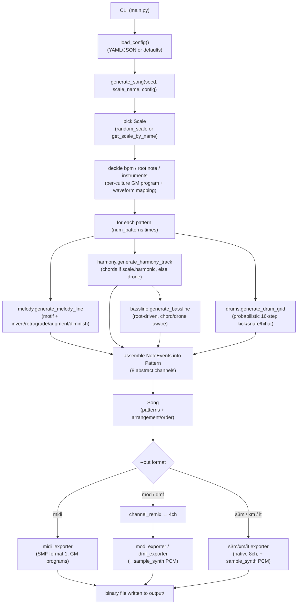

# TrackerMaker

**[English](#english) | [日本語](./README.ja.md)**

A seed-reproducible, world-scale-aware random composition engine for classic music trackers — written in pure Python with (almost) no external dependencies.

---

## English

### 1. What this project is

TrackerMaker is a small compositional engine that:

1. Picks a musical scale at random from a library of **41 scales drawn from musical traditions around the world** (Western church modes, Arabic maqamat, Indian ragas, Japanese pentatonics, Chinese pentatonic modes, Indonesian gamelan tunings, and more).
2. Generates a short piece of music (melody, harmony/drone, bassline, drums) algorithmically, using motif-based melodic development (inversion, retrograde, augmentation, diminution).
3. Exports the same internal song representation to **six different binary formats**: Standard MIDI, and five classic tracker module formats (`.mod`, `.s3m`, `.xm`, `.it`, `.dmf`).

The key design idea is a strict separation between:

- an **abstract, format-agnostic internal song model** (`Song`, `Pattern`, `Channel`, `NoteEvent`, `Instrument`, `Effect`, `Scale`), and
- a set of independent **exporters** that translate that model into a specific binary layout.

This means the composition logic (melody/harmony/bass/drums) is written exactly once, and every output format benefits from it identically.

### 2. What it can do / what it cannot do

**It can:**

- Generate fully reproducible songs from an integer seed (`--seed 1234` always produces the same song).
- Randomly select — or let you force — one of 41 world scales, and automatically decide whether the culture associated with that scale is harmonic (chord-progression based) or non-harmonic (drone + melody based).
- Export to MIDI (`.mid`), ProTracker MOD (`.mod`), ScreamTracker 3 (`.s3m`), FastTracker 2 XM (`.xm`), and Impulse Tracker (`.it`) with byte-level structural correctness (verified: chunk sizes, pointer tables, and sample/pattern offsets all resolve exactly to the file length, for every scale in the library).
- Synthesize its own simple instrument samples (sine/square/saw/triangle waveforms, plus percussive noise/kick samples) purely in Python — no sample libraries required.
- Read composition parameters (tempo range, pattern length/count, chord-change rate, etc.) from an optional YAML/JSON config file.

**It cannot (yet):**

- Produce microtonal / quarter-tone pitch accuracy for maqamat and ragas — all scales are approximated to 12-tone equal temperament, since every output format targets 12-TET instruments/samples.
- Guarantee correctness of the `.dmf` (DefleMask) exporter. The DMF format is an undocumented, versioned, zlib-compressed binary format reverse-engineered by the community. This exporter is a **best-effort, experimental** implementation that has not been validated by opening the output in DefleMask or Furnace. Treat `.dmf` output as "likely works, unverified" — the other five formats are structurally verified.
- Use real sampled instruments (piano, sitar, koto, etc.) — instrument color for tracker formats comes from synthesized waveforms; for MIDI export, General MIDI program numbers are chosen by musical culture as a reasonable stand-in.
- Generate anything longer than a short loop-based arrangement (a handful of patterns played in a simple repeating structure) — there's no long-form structure (verse/chorus, key changes, etc.).

### 3. Requirements & installation

TrackerMaker's core (composition engine + all six exporters) uses **only the Python standard library**. No dependency is required to run it with the default configuration.

```bash
git clone <this-repo>
cd TrackerMaker
python main.py --seed 1234 --out midi
```

The only optional dependency is **PyYAML**, needed only if you pass a `.yaml`/`.yml` file via `--config`. If you prefer JSON config files, you need nothing extra.

```bash
pip install -r requirements.txt   # only needed for YAML config files
```

Requires Python 3.8+ (uses `dataclasses`, f-strings, `from __future__ import annotations`).

### 4. Usage

```bash
python main.py --seed 1234 --out midi
python main.py --out xm
python main.py --out mod
python main.py --out it
python main.py --out s3m
python main.py --out dmf
python main.py --out all --config example_config.yaml
python main.py --list-scales
python main.py --scale "Hijaz" --out midi --title "Desert Night"
```

#### CLI options

| Option | Description | Default |
|---|---|---|
| `--seed <int>` | Random seed. Same seed + same config ⇒ identical song. Omit for a random seed. | random |
| `--out <fmt>` | Output format: `midi`, `mod`, `s3m`, `xm`, `it`, `dmf`, or `all` (writes every format at once). | `midi` |
| `--output-dir <path>` | Directory the generated file(s) are written to (created if missing). | `output` |
| `--title <str>` | Song title embedded in the file. If omitted, auto-generated from the scale name/culture. | auto |
| `--scale <name>` | Force a specific scale by (partial, case-insensitive) name instead of picking randomly, e.g. `"Dorian"`, `"Raga Yaman"`, `"陰音階"`. | random |
| `--config <path>` | Path to a `.yaml`/`.yml` or `.json` config file overriding composition defaults (see below). | none |
| `--list-scales` | Print all 41 available scale names with their cultural tag, then exit. | — |

#### Config file fields

All fields are optional; unspecified fields fall back to the defaults shown.

```yaml
rows_per_pattern: 64     # rows per pattern
num_patterns: 4          # number of distinct patterns generated
bpm_min: 90               # tempo random range (BPM)
bpm_max: 160
speed: 6                  # tracker "speed" (ticks per row)
chord_change_rows: 16     # how often chords/drone re-trigger, in rows
bass_pulse_rows: 4        # how often the bassline re-triggers, in rows
root_note_min: 48         # MIDI note range the scale's root is randomly chosen from
root_note_max: 64
```

### 5. Output formats

| Format | Extension | Channels (native) | Notes |
|---|---|---|---|
| Standard MIDI File (format 1) | `.mid` | up to 16 (uses 5: tempo + melody + bass + chord + drums) | Chords rendered as simultaneous notes on one MIDI channel; drums mapped to GM percussion channel 10 (kick=36, snare=38, hihat=42). |
| ProTracker MOD | `.mod` | 4 (fixed) | Classic Amiga `M.K.` 31-sample format. Internal 8-channel model is reduced to 4 via channel merging (see below). Patterns are normalized to the format's mandatory 64 rows. |
| ScreamTracker 3 | `.s3m` | up to 32 (uses internal channel count, 8 by default) | Unsigned 8-bit PCM samples, mono mixing (to avoid unintended hard-left/right panning artifacts from the simplified channel-type table). |
| FastTracker 2 | `.xm` | up to 32 (uses internal channel count, 8 by default) | Signed 8-bit delta-encoded PCM samples per the XM spec; linear frequency table. |
| Impulse Tracker | `.it` | up to 64 (uses internal channel count, 8 by default) | Old-style (non-instrument-mode) sample slots — simpler and functionally equivalent to using full instrument envelopes, since none are used here. |
| DefleMask | `.dmf` | 4 (Game Boy system: SQ1/SQ2/WAVE/NOISE) | **Experimental.** zlib-compressed custom binary; best-effort reconstruction from community documentation, unverified against real DefleMask/Furnace software. |

#### Internal 8-channel abstraction

Every song is composed internally with a fixed, format-agnostic 8-channel layout:

```
0: melody        4: chord/drone (voice 3)
1: bass          5: kick
2: chord/drone (voice 1)   6: snare
3: chord/drone (voice 2)   7: hihat
```

For formats with fewer native channels (MOD's fixed 4, DMF's Game Boy 4), a `channel_remix` step merges channels right before export — e.g. the three chord/drone voices collapse into one channel (first non-empty event wins per row), and the three drum voices collapse into one channel with kick > snare > hihat priority. Formats with 8+ channels (MIDI, S3M, XM, IT) use the full layout directly (MIDI further folds the 3 chord channels onto a single MIDI channel, since simultaneous notes on one MIDI channel *are* a chord).

### 6. Processing flow



### 7. Technical highlights

- **Culture-driven abstraction of "scale"**: every scale — Western, Arabic, Indian, Japanese, Chinese, gamelan, or otherwise — is represented purely as a `root` plus an `intervals` array (semitone steps between adjacent scale degrees, summing to 12). Pitch generation, chord-building, and drone construction all operate on scale *degrees*, so the same code path produces musically sensible output whether the scale has 5, 6, 7, or 8 notes.
- **Motif-based melodic development**: a short random motif (3–6 notes, bounded leap size) is generated once per pattern, then developed via classical transformations — inversion, retrograde, rhythmic augmentation and diminution — and stitched together, occasionally resolving back to the tonic. This gives the generated melodies a recognizable identity instead of being pure note-soup.
- **Automatic harmonic/non-harmonic behavior**: each `Scale` carries a `harmonic` flag. Harmonic-culture scales (Western, Arabic, Persian, jazz-derived, etc.) get a tertian chord progression built by stacking every other scale degree. Non-harmonic-culture scales (Japanese, gamelan, ragas, Chinese pentatonic modes) instead get a sustained drone (root, plus the scale's closest approximation of a perfect fifth if present).
- **Zero-dependency binary exporters**: MIDI, MOD, S3M, XM, and IT files are constructed byte-by-byte using only `struct`/`zlib` from the standard library — no `mido`, `pretty_midi`, or tracker-writing libraries involved. Pattern/instrument/sample pointer tables are computed with a deterministic single-pass layout algorithm (no guesswork or post-hoc patching).
- **In-Python sample synthesis**: instead of shipping WAV/sample assets, tracker-format instruments are synthesized on the fly (sine/square/saw/triangle for melodic voices, exponentially-decaying pitch-swept sine for kick, filtered noise for snare/hihat), keeping the whole project dependency-free and self-contained.
- **Verified structural integrity**: an automated check across all 41 scales × multiple seeds × all 6 formats confirms every pointer/offset table resolves exactly to the file's actual byte layout, with zero exceptions raised during generation.

### 8. Possible future extensions

- Microtonal pitch support (pitch-bend-per-note in MIDI, or fine-tune tables in trackers) to more faithfully render maqam/raga quarter-tones.
- Real sample-based instruments (bundled short WAV samples per culture) instead of synthesized waveforms.
- Effect-column usage (vibrato, portamento, volume slides) now that the `Effect`/`EffectType` model already exists in `core/models.py` but isn't populated by the composer yet.
- Longer-form arrangement logic (intro/verse/chorus/outro, key modulation, dynamic tempo changes) beyond the current short repeating-pattern structure.
- Validating and hardening the `.dmf` exporter against a real DefleMask/Furnace import, and extending it to other DMF chip systems (Genesis, NES, SMS) beyond Game Boy.
- A `--list-scales --verbose` or `--describe-scale <name>` mode showing interval structure and example note names.
- Unit tests around the scale/melody/harmony modules to lock in behavior as the project grows.

### 9. Project structure

```
main.py                      CLI entry point
requirements.txt             optional dependencies (PyYAML for YAML config)
example_config.yaml          example configuration file
trackermaker/
  config.py                  YAML/JSON config loader + defaults
  core/
    models.py                 Song / Pattern / Channel / NoteEvent / Instrument / Effect
    scale.py                  Scale model + the 41-scale world library
  compose/
    melody.py                  motif generation & transformation
    harmony.py                  chord progression / drone generation
    bassline.py                 bassline generation
    drums.py                    probabilistic drum pattern generation
    composer.py                  orchestrates the above into a Song
  export/
    sample_synth.py              waveform/percussion PCM synthesis
    channel_remix.py             8ch → fewer-channel reduction for MOD/DMF
    midi_exporter.py
    mod_exporter.py
    s3m_exporter.py
    xm_exporter.py
    it_exporter.py
    dmf_exporter.py              experimental
```

### 10. License

No license file is currently included in this repository. Add a `LICENSE` file (e.g. MIT, Apache-2.0) before publishing publicly if you intend others to reuse this code.
